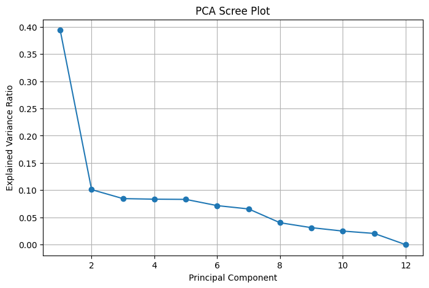
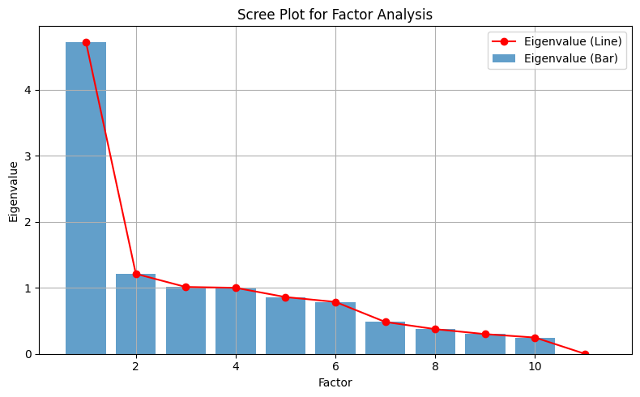

```python
# connect google drive into colab
from google.colab import drive
drive.mount('/content/drive')
```

    Drive already mounted at /content/drive; to attempt to forcibly remount, call drive.mount("/content/drive", force_remount=True).
    


```python
import pandas as pd

# Replace 'your_file.csv' with the path to your dataset in Google Drive
file_path = '/content/drive/My Drive/Multi Project/student_dataset.csv'

# Load the dataset
df = pd.read_csv(file_path)

# Drop rows with any missing (null) values
df_clean = df.dropna()

# Optionally, save the cleaned dataset back to Drive
df_clean.to_csv('/content/drive/My Drive/your_file_cleaned.csv', index=False)

# Display the cleaned DataFrame
print(df_clean)
```

          Student_ID First_Name Last_Name                           Email  Gender  \
    0         S00001   Danielle      Levy        danielle1@university.edu  Female   
    1         S00002      Angel    Ortega     angel.ortega@university.edu    Male   
    2         S00003     Joshua     Lopez          joshua4@university.edu  Female   
    3         S00004    Jeffrey    Powers          jpowers@university.edu  Female   
    4         S00005       Jill  Robinson        jrobinson@university.edu  Female   
    ...          ...        ...       ...                             ...     ...   
    49995     S49996      David    Lawson           david9@university.edu    Male   
    49996     S49997     Jeremy     Davis          jeremy7@university.edu    Male   
    49997     S49998    Timothy     Perry           s49998@university.edu  Female   
    49998     S49999     Philip  Martinez  philip_martinez@university.edu    Male   
    49999     S50000      Joyce   Aguilar           s50000@university.edu  Female   
    
           Age            Department  Attendance (%)  Midterm_Score  \
    0       18      Computer Science            83.9           68.9   
    1       18  Software Engineering            75.2           96.2   
    2       21          Data Science           100.0           63.2   
    3       30  Software Engineering            82.1           65.1   
    4       20  Software Engineering            95.0           95.0   
    ...    ...                   ...             ...            ...   
    49995   20      Computer Science            74.8           65.9   
    49996   21      Computer Science            78.2           78.3   
    49997   29          Data Science            73.6           85.9   
    49998   29  Software Engineering            84.4           84.0   
    49999   18          Data Science            76.1           50.2   
    
           Assignments_Avg  ...  Participation_Score  Projects_Score  Total_Marks  \
    0            57.800000  ...                  4.8       79.500000        67.71   
    1            86.500000  ...                 10.0       99.000000        93.30   
    2            62.991805  ...                  7.6       51.422311        62.56   
    3            66.300000  ...                  6.0       66.900000        66.76   
    4            86.200000  ...                  7.5       79.900000        83.70   
    ...                ...  ...                  ...             ...          ...   
    49995        57.300000  ...                  7.0       54.200000        56.40   
    49996        79.800000  ...                  8.7       74.800000        77.31   
    49997        75.300740  ...                 10.0       59.882653        73.72   
    49998        94.800000  ...                  9.6       83.400000        89.58   
    49999        53.500000  ...                  9.4       80.000000        65.16   
    
           Grade Study_Hours_per_Week  Extracurricular_Activities  \
    0          D                 13.5                         Yes   
    1          A                 21.7                          No   
    2          D                 12.0                         Yes   
    3          D                 10.1                          No   
    4          B                 18.1                         Yes   
    ...      ...                  ...                         ...   
    49995      F                 13.3                         Yes   
    49996      C                 10.7                         Yes   
    49997      C                 10.6                         Yes   
    49998      B                 12.4                          No   
    49999      D                  2.0                          No   
    
          Internet_Access_at_Home Parent_Education_Level  Stress_Level (1-10)  \
    0                         Yes                      3                    6   
    1                         Yes                      2                   10   
    2                          No                      3                    6   
    3                         Yes                      2                    4   
    4                         Yes                      3                    8   
    ...                       ...                    ...                  ...   
    49995                     Yes                      4                   10   
    49996                     Yes                      3                    8   
    49997                      No                      2                    7   
    49998                     Yes                      3                    6   
    49999                     Yes                      2                    2   
    
           Sleep_Hours_per_Night  
    0                        8.2  
    1                        7.1  
    2                        8.5  
    3                        7.7  
    4                        7.1  
    ...                      ...  
    49995                    5.8  
    49996                    5.2  
    49997                    7.7  
    49998                    7.3  
    49999                    6.9  
    
    [50000 rows x 21 columns]
    


```python
# Drop student-Id

df_clean.drop(columns=['Student_ID'], inplace=True)
```


```python
# Drop Duplicate

df_clean.drop_duplicates(inplace=True)
```


```python
#Remove Outliers
def remove_outliers_iqr(df_clean):
    numeric_cols = df_clean.select_dtypes(include=[np.number]).columns
    Q1 = df_clean[numeric_cols].quantile(0.25)
    Q3 = df_clean[numeric_cols].quantile(0.75)
    IQR = Q3 - Q1
    filtered_entries = ~((df_clean[numeric_cols] < (Q1 - 1.5 * IQR)) | (df_clean[numeric_cols] > (Q3 + 1.5 * IQR))).any(axis=1)
    return df_clean[filtered_entries]

```


```python
#Encode Categorical Variables

# Example for one-hot encoding
categorical_cols = df_clean.select_dtypes(include=['object', 'category']).columns
df1 = pd.get_dummies(df_clean, columns=categorical_cols, drop_first=True)
```


```python
#Only Standardize Numeric Columns
from sklearn.preprocessing import StandardScaler
# Select only numeric columns for scaling
numeric_cols = df1.select_dtypes(include=['float64', 'int64']).columns

# Standardize only numeric columns
scaler = StandardScaler()
df1[numeric_cols] = scaler.fit_transform(df1[numeric_cols])
```


```python

#This is important packages

import pandas as pd
import numpy as np
from sklearn.decomposition import PCA
import matplotlib.pyplot as plt
from sklearn.model_selection import train_test_split
from sklearn.discriminant_analysis import LinearDiscriminantAnalysis
from sklearn.preprocessing import LabelEncoder
from sklearn.metrics import classification_report, accuracy_score
!pip install factor_analyzer
from factor_analyzer import FactorAnalyzer

```

    Collecting factor_analyzer
      Downloading factor_analyzer-0.5.1.tar.gz (42 kB)
    [?25l     ━━━━━━━━━━━━━━━━━━━━━━━━━━━━━━━━━━━━━━━━ 0.0/42.8 kB ? eta -:--:--
     ━━━━━━━━━━━━━━━━━━━━━━━━━━━━━━━━━━━━━━━━ 42.8/42.8 kB 1.6 MB/s eta 0:00:00
    [?25h  Installing build dependencies ... [?25l[?25hdone
      Getting requirements to build wheel ... [?25l[?25hdone
      Preparing metadata (pyproject.toml) ... [?25l[?25hdone
    Requirement already satisfied: pandas in /usr/local/lib/python3.11/dist-packages (from factor_analyzer) (2.2.2)
    Requirement already satisfied: scipy in /usr/local/lib/python3.11/dist-packages (from factor_analyzer) (1.15.3)
    Requirement already satisfied: numpy in /usr/local/lib/python3.11/dist-packages (from factor_analyzer) (2.0.2)
    Requirement already satisfied: scikit-learn in /usr/local/lib/python3.11/dist-packages (from factor_analyzer) (1.6.1)
    Requirement already satisfied: python-dateutil>=2.8.2 in /usr/local/lib/python3.11/dist-packages (from pandas->factor_analyzer) (2.9.0.post0)
    Requirement already satisfied: pytz>=2020.1 in /usr/local/lib/python3.11/dist-packages (from pandas->factor_analyzer) (2025.2)
    Requirement already satisfied: tzdata>=2022.7 in /usr/local/lib/python3.11/dist-packages (from pandas->factor_analyzer) (2025.2)
    Requirement already satisfied: joblib>=1.2.0 in /usr/local/lib/python3.11/dist-packages (from scikit-learn->factor_analyzer) (1.5.1)
    Requirement already satisfied: threadpoolctl>=3.1.0 in /usr/local/lib/python3.11/dist-packages (from scikit-learn->factor_analyzer) (3.6.0)
    Requirement already satisfied: six>=1.5 in /usr/local/lib/python3.11/dist-packages (from python-dateutil>=2.8.2->pandas->factor_analyzer) (1.17.0)
    Building wheels for collected packages: factor_analyzer
      Building wheel for factor_analyzer (pyproject.toml) ... [?25l[?25hdone
      Created wheel for factor_analyzer: filename=factor_analyzer-0.5.1-py2.py3-none-any.whl size=42655 sha256=728c421514e1875f05c4e22ce228876102c4dec91eb4ba496751c3996f6fb502
      Stored in directory: /root/.cache/pip/wheels/fa/f7/53/a55a8a56668a6fe0199e0e02b6e0ae3007ec35cdf6e4c25df7
    Successfully built factor_analyzer
    Installing collected packages: factor_analyzer
    Successfully installed factor_analyzer-0.5.1
    


```python
# Doing PCA
```


```python
# Select only numeric columns (should be all at this stage)
X = df1.select_dtypes(include=['float64', 'int64'])
```


```python
# Fit PCA to all components
pca = PCA()
X_pca = pca.fit_transform(X)
```


```python
plt.figure(figsize=(8,5))
plt.plot(range(1, len(pca.explained_variance_ratio_)+1), pca.explained_variance_ratio_, marker='o')
plt.xlabel('Principal Component')
plt.ylabel('Explained Variance Ratio')
plt.title('PCA Scree Plot')
plt.grid(True)
plt.show()
```


    

    


```python
# Create a DataFrame with PCA values
pca_df = pd.DataFrame(X_pca, columns=[f'PC{i+1}' for i in range(X_pca.shape[1])])

# Save to CSV if needed
pca_df.to_csv('test_pca_values.csv', index=False)

# Show first few rows
print(pca_df.head())
```

            PC1       PC2       PC3       PC4       PC5       PC6       PC7  \
    0 -1.151741 -0.786973 -0.100319 -1.035154 -0.210054  0.826829  0.471806   
    1  3.099522  1.421058 -1.434349 -0.359198 -1.288357  1.537127  1.150175   
    2 -1.353077 -0.943739  1.255167 -0.433755  0.696513  0.866376  0.644085   
    3 -1.182937 -1.275760 -0.078315  2.503860  1.072916 -0.369052 -0.430132   
    4  1.631461  0.661094  0.524026 -0.612933  0.393096  1.509965  0.408564   
    
            PC8       PC9      PC10      PC11          PC12  
    0 -0.959820 -0.227762 -0.303034 -0.899540 -8.928616e-08  
    1  0.353889 -0.612150 -0.112428 -0.528316 -3.019971e-04  
    2  0.821798  0.886610  0.580503  0.250256  2.952615e-04  
    3 -0.458733  0.364076 -0.021037 -0.048746 -3.029295e-04  
    4 -0.145292 -0.674233  0.532014  0.182326  3.040540e-04  
    


```python
pca = PCA(n_components=0.7)
X_pca = pca.fit_transform(X)
print("Number of components to retain 70% variance:", pca.n_components_)
```

    Number of components to retain 70% variance: 5
    


```python
import numpy as np

# After fitting PCA
explained_var_ratios = pca.explained_variance_ratio_

# Convert to percentage and round
explained_var_percent = np.round(explained_var_ratios * 100, 2)

# Print in the desired format (first 5 components as example)
print("The first five principal components explain:")
for i, pct in enumerate(explained_var_percent[:5], 1):
    print(f"PC{i}: {pct}%")

print(f"Total variance explained by first five PCs: {explained_var_percent[:5].sum()}%")

```

    The first five principal components explain:
    PC1: 39.39%
    PC2: 10.1%
    PC3: 8.45%
    PC4: 8.35%
    PC5: 8.31%
    Total variance explained by first five PCs: 74.6%
    


```python
import numpy as np
import pandas as pd

# Calculate PCA loadings (correlations between original variables and PCs)
loadings = pca.components_.T * np.sqrt(pca.explained_variance_)

# Create a DataFrame with loadings
numeric_cols = df_clean.select_dtypes(include=['float64', 'int64']).columns
loading_matrix = pd.DataFrame(
    loadings,
    columns=[f'PC{i+1}' for i in range(loadings.shape[1])],
    index=numeric_cols
)

# Display loadings for first 5 PCs
print("PCA Loadings Matrix (First 5 Components):")
print(loading_matrix.iloc[:, :5].round(3))

# Find the most important variables for each PC
print("\nMost Important Variables for Each PC:")
for i in range(5):  # First 5 PCs
    pc_name = f'PC{i+1}'
    # Get absolute loadings and sort
    abs_loadings = loading_matrix[pc_name].abs().sort_values(ascending=False)
    top_3_vars = abs_loadings.head(3)

    print(f"\n{pc_name}:")
    for var, loading in top_3_vars.items():
        direction = "positive" if loading_matrix.loc[var, pc_name] > 0 else "negative"
        print(f"  - {var}: {loading_matrix.loc[var, pc_name]:.3f} ({direction})")

```

    PCA Loadings Matrix (First 5 Components):
                              PC1    PC2    PC3    PC4    PC5
    Age                     0.002 -0.003 -0.055  0.832  0.550
    Attendance (%)          0.128  0.021  0.907 -0.107  0.272
    Midterm_Score           0.866 -0.009  0.024 -0.007  0.001
    Assignments_Avg         0.890 -0.005  0.023 -0.003  0.004
    Quizzes_Avg             0.823 -0.012  0.023 -0.010  0.007
    Participation_Score     0.753 -0.007 -0.132  0.012 -0.045
    Projects_Score          0.881 -0.014  0.028 -0.004  0.009
    Total_Marks             0.995 -0.011  0.008 -0.004 -0.000
    Study_Hours_per_Week    0.397  0.073 -0.283  0.057 -0.036
    Parent_Education_Level -0.008 -0.035 -0.297 -0.542  0.785
    Stress_Level (1-10)     0.022  0.778 -0.001  0.006  0.013
    Sleep_Hours_per_Night  -0.002 -0.774  0.010  0.029 -0.021
    
    Most Important Variables for Each PC:
    
    PC1:
      - Total_Marks: 0.995 (positive)
      - Assignments_Avg: 0.890 (positive)
      - Projects_Score: 0.881 (positive)
    
    PC2:
      - Stress_Level (1-10): 0.778 (positive)
      - Sleep_Hours_per_Night: -0.774 (negative)
      - Study_Hours_per_Week: 0.073 (positive)
    
    PC3:
      - Attendance (%): 0.907 (positive)
      - Parent_Education_Level: -0.297 (negative)
      - Study_Hours_per_Week: -0.283 (negative)
    
    PC4:
      - Age: 0.832 (positive)
      - Parent_Education_Level: -0.542 (negative)
      - Attendance (%): -0.107 (negative)
    
    PC5:
      - Parent_Education_Level: 0.785 (positive)
      - Age: 0.550 (positive)
      - Attendance (%): 0.272 (positive)
    


```python
#Donig Discriminant Anlysis
```


```python
drop_cols = ['Student_ID', 'First_Name', 'Last_Name', 'Email']
df = df.drop(columns=drop_cols)
```


```python
# List all categorical columns (except the target 'Grade')
categorical_cols = ['Gender', 'Department', 'Extracurricular_Activities',
                    'Internet_Access_at_Home', 'Parent_Education_Level']
```


```python
# One-hot encode all categorical columns except the target
df = pd.get_dummies(df, columns=categorical_cols, drop_first=True)
```


```python
# Now separate features and target
X = df.drop(columns=['Grade'])
y = df['Grade']
```


```python
# Encode the target variable (if not already numeric)
le = LabelEncoder()
y_encoded = le.fit_transform(y)
```


```python
# Remove rows with missing target (if any)
mask = pd.notna(y)
X = X[mask]
y_encoded = y_encoded[mask]
```


```python
# Split into train and test sets
X_train, X_test, y_train, y_test = train_test_split(
    X, y_encoded, test_size=0.3, random_state=42, stratify=y_encoded)
```


```python
#  Fit LDA
lda = LinearDiscriminantAnalysis()
lda.fit(X_train, y_train)
y_pred = lda.predict(X_test)
```


```python
# Print results
print("Discriminant Analysis Accuracy:", accuracy_score(y_test, y_pred))
print("\nClassification Report:\n", classification_report(y_test, y_pred, target_names=le.classes_))
```

    Discriminant Analysis Accuracy: 0.9552
    
    Classification Report:
                   precision    recall  f1-score   support
    
               A       0.99      0.96      0.98      2306
               B       0.96      0.97      0.96      3193
               C       0.96      0.98      0.97      3766
               D       0.89      0.97      0.93      3089
               F       1.00      0.88      0.93      2646
    
        accuracy                           0.96     15000
       macro avg       0.96      0.95      0.95     15000
    weighted avg       0.96      0.96      0.96     15000
    
    


```python
#  (Optional) Show LDA coefficients
import numpy as np
import pandas as pd
loadings = pd.DataFrame(
    lda.coef_.T, index=X.columns,
    columns=[f'LD{i+1}' for i in range(lda.coef_.shape[0])]
)
print("\nLDA Loadings (Coefficients for each Linear Discriminant Function):")
print(loadings.round(3))

```

    
    LDA Loadings (Coefficients for each Linear Discriminant Function):
                                        LD1    LD2    LD3    LD4     LD5
    Age                              -0.001 -0.003  0.001  0.003   0.000
    Attendance (%)                   -0.002 -0.001  0.001 -0.000   0.001
    Midterm_Score                     5.364  1.003 -0.176 -1.679  -3.673
    Assignments_Avg                   4.336  0.820 -0.141 -1.365  -2.973
    Quizzes_Avg                       3.221  0.604 -0.105 -1.009  -2.209
    Participation_Score              21.392  3.992 -0.678 -6.695 -14.678
    Projects_Score                    6.499  1.232 -0.214 -2.042  -4.463
    Total_Marks                     -20.038 -3.285  0.771  6.122  13.183
    Study_Hours_per_Week              0.011 -0.003 -0.004  0.001  -0.001
    Stress_Level (1-10)              -0.019 -0.014  0.001  0.009   0.021
    Sleep_Hours_per_Night            -0.020  0.001 -0.009  0.015   0.012
    Gender_Male                      -0.084 -0.056  0.024  0.016   0.088
    Department_Data Science           0.089 -0.024  0.038  0.001  -0.103
    Department_Software Engineering  -0.048 -0.029 -0.006  0.024   0.057
    Extracurricular_Activities_Yes   -0.071 -0.052  0.002  0.014   0.104
    Internet_Access_at_Home_Yes      -0.234 -0.102  0.040  0.107   0.145
    Parent_Education_Level_1          0.019 -0.110 -0.017 -0.005   0.145
    Parent_Education_Level_2          0.013 -0.050 -0.037 -0.015   0.119
    Parent_Education_Level_3         -0.160 -0.131  0.006  0.026   0.259
    Parent_Education_Level_4          0.047 -0.108  0.001  0.002   0.085
    


```python
#Doig Factor Anlysis
```


```python
drop_cols = ['Student_ID', 'First_Name', 'Last_Name', 'Email', 'Gender', 'Department',
             'Grade', 'Extracurricular_Activities', 'Internet_Access_at_Home', 'Parent_Education_Level']
df_numeric = df.drop(columns=drop_cols)

# Ensure only numeric columns
df_numeric = df_numeric.select_dtypes(include=['float64', 'int64'])
```


```python
# Choose number of factors (e.g., 3)
fa = FactorAnalyzer(n_factors=3, rotation='varimax')
fa.fit(df_numeric)

#to handle jupyter warings
import warnings
warnings.filterwarnings("ignore", message=".*force_all_finite.*", category=FutureWarning)

```


```python
# Factor loadings
loadings = pd.DataFrame(fa.loadings_,
                        index=df_numeric.columns,
                        columns=['Factor1', 'Factor2', 'Factor3'])
print("Factor Loadings:\n", loadings.round(2))

# Variance explained by each factor
variance = fa.get_factor_variance()
print("\nVariance Explained (per factor):\n", variance)
```

    Factor Loadings:
                            Factor1  Factor2  Factor3
    Age                       0.00     0.00    -0.00
    Attendance (%)            0.05     0.01     0.62
    Midterm_Score             0.83    -0.01     0.10
    Assignments_Avg           0.86    -0.01     0.10
    Quizzes_Avg               0.77    -0.01     0.09
    Participation_Score       0.70    -0.00    -0.06
    Projects_Score            0.85    -0.02     0.11
    Total_Marks               1.02    -0.02     0.09
    Study_Hours_per_Week      0.34     0.03    -0.03
    Stress_Level (1-10)       0.03     0.86     0.01
    Sleep_Hours_per_Night    -0.00    -0.25    -0.00
    
    Variance Explained (per factor):
     (array([4.41236397, 0.793965  , 0.43459112]), array([0.401124  , 0.07217864, 0.03950828]), array([0.401124  , 0.47330263, 0.51281092]))
    


```python
# Fit FactorAnalyzer with no rotation to get eigenvalues
fa = FactorAnalyzer(rotation=None)
fa.fit(df_numeric)

# Get eigenvalues
ev, v = fa.get_eigenvalues()

# Make the scree plot
plt.figure(figsize=(8, 5))
plt.bar(range(1, len(ev)+1), ev, alpha=0.7, label='Eigenvalue (Bar)')
plt.plot(range(1, len(ev)+1), ev, marker='o', color='red', label='Eigenvalue (Line)')
plt.xlabel('Factor')
plt.ylabel('Eigenvalue')
plt.title('Scree Plot for Factor Analysis')
plt.legend()
plt.grid(True)
plt.tight_layout()
plt.show()
```


    

    

